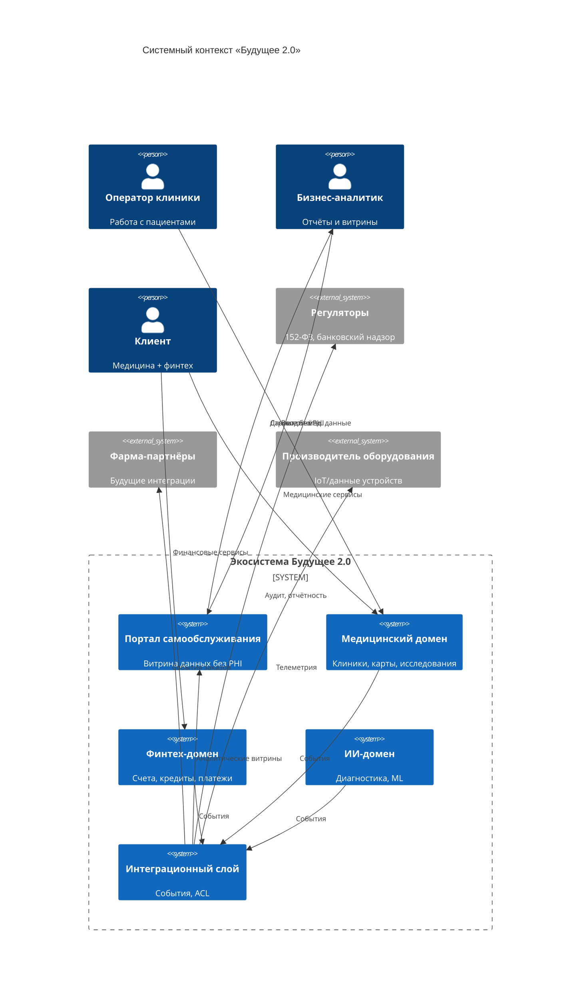
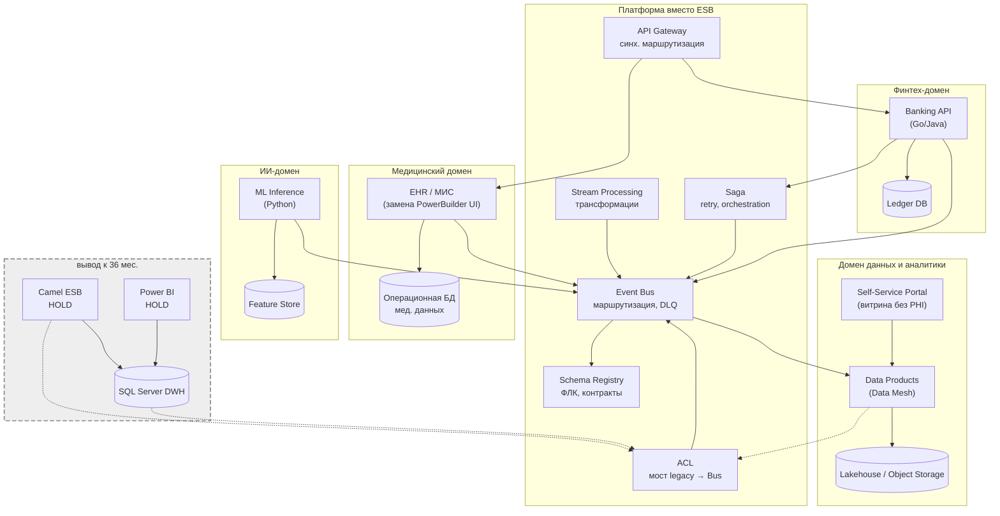

# C4: уровень контейнеров — «Будущее 2.0» (целевое состояние, 3 года)

## Контекст (Level 1)

## Контейнеры (Level 2)

## Ключевые изменения vs AS-IS

| AS-IS | TO-BE (3 года) |
|-------|----------------|
| DWH — центр всей логики | Доменные OLTP + Data Products; DWH только как мост |
| Camel — маршрутизация, ETL, оркестрация | Bus, Gateway, Schema, Stream, Saga; Camel **вывод** |
| Power BI на DWH | Self-service portal + доменные витрины |
| PHI в аналитике | PHI только в мед. домене; портал — агрегаты без карт |
| Синхронные интеграции | События + near-real-time потоки |
