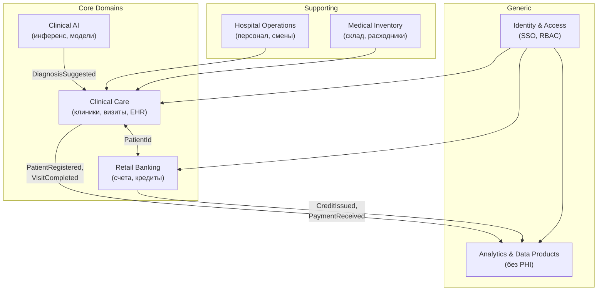

# Bounded Contexts — «Будущее 2.0»

## Контексты

| Bounded Context | Ответственность | Не включает |
|-----------------|-----------------|-------------|
| **Clinical Care** | Медкарты, визиты, назначения, снимки | Кредитный скоринг |
| **Retail Banking** | Счета, платежи, кредиты | Диагнозы, PHI |
| **Clinical AI** | ML-инференс, рекомендации | Хранение первичных карт (только читает) |
| **Hospital Operations** | Расписания, персонал | Финансовый ledger |
| **Medical Inventory** | Остатки, заказы расходников | BI-отчёты |
| **Analytics & Data Products** | Витрины, агрегаты, портал | PHI, истории болезней |
| **Identity & Access** | SSO, роли, consent | Бизнес-логику доменов |

## Context Map (отношения)

| Upstream | Downstream | Тип связи |
|----------|------------|-----------|
| Clinical Care | Analytics | Published Language (события без PHI) |
| Retail Banking | Analytics | Published Language |
| Clinical AI | Clinical Care | Customer-Supplier |
| Clinical Care | Retail Banking | Partnership (PatientId) |
| Legacy DWH | Analytics | ACL / Conformist (временно) |
