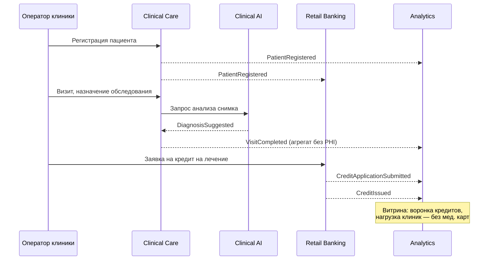
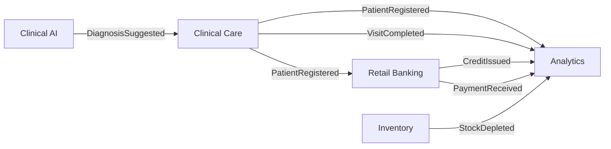

# Event Storming — сквозной сценарий «Пациент + кредит на лечение»

## Потоки по доменам

## Легенда

- **Команда** — действие пользователя (регистрация, заявка на кредит).
- **Событие** — факт в прошедшем времени (опубликован в шину).
- **Политика** — реакция подписчика (FT создаёт профиль клиента на `PatientRegistered`).
