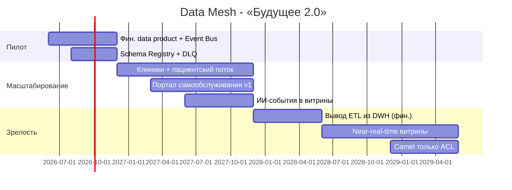

# Роадмап внедрения Data Mesh

## Роли

| Роль | Ответственность |
|------|-----------------|
| **Data Product Owner** | Владелец data product домена, SLA, приоритеты |
| **Data Engineer** | Пайплайны, контракты, качество данных |
| **BI-аналитик** | Семантика витрин, self-service на портале |
| **Platform Engineer** | Kafka, Lakehouse, IaC |
| **Enterprise Architect** | Границы доменов, ACL |

## Этапы

## Привязка к бизнес-целям

| Этап | Срок | Бизнес-цель |
|------|------|-------------|
| Пилот (фин. расчёты) | 0–6 мес. | Быстрые отчёты по кредитам; проверка модели |
| Масштабирование | 6–18 мес. | Пациентский поток, портал для аналитиков |
| Зрелость | 18–36 мес. | Новые регионы и фарма без переписывания DWH |
| Горизонт 3 года | 36 мес. | Событийная платформа, near-real-time KPI |

## KPI успеха

- % отчётов через портал (цель: 80% к 18 мес.).
- Latency витрин P95 < 5 мин (near-real-time).
- Количество data products по доменам ≥ 1 на домен к 12 мес.
